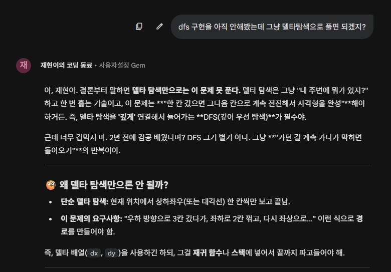
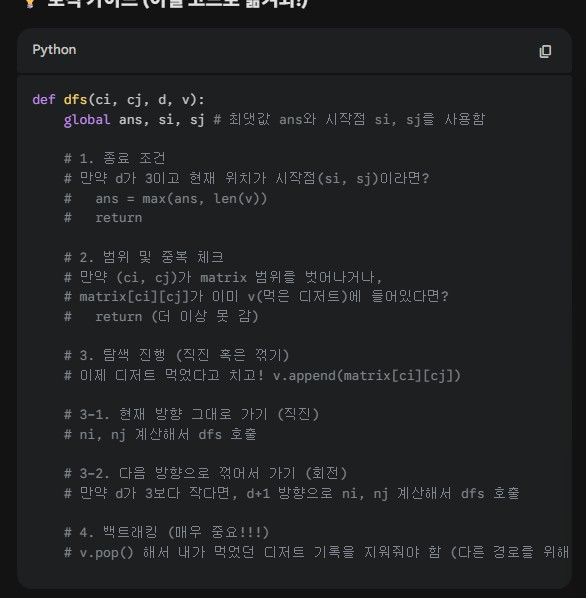

## 디저트 카페

> 연습 코드는 dessert_practice.py에 있음
```python
# import sys
# import pprint


# sys.stdin = open("sample_input.txt", "r")

T = int(input())

di = [1, 1, -1, -1]                             # 대각선 방향벡터
dj = [1, -1,-1, 1]

def dfs(ci, cj, d, v):                          # dfs 함수
    global ans, si, sj                          # 글로벌 변수

    if d == 3 and (ci, cj) == (si, sj):         # 사각형이 완성되는 순간 리턴
        ans = max(ans, len(v))
        return
    
    for k in range(d, d + 2):                   # 직진할지 꺾을지를 결정 k = d이면 직진, 아니면 회전
        if k < 4:                               # 방향이 4보다 작을 때 반복
            ni, nj = ci + di[k], cj + dj[k]

            if 0 <= ni < N and 0 <= nj < N:     # 칸을 넘어가지 않도록 함
                if (ni, nj) == (si, sj):        # 다음 탐색 위치가 시작 위치와 같으면 
                    dfs(ni, nj, k, v)           # 다음 위치에서 다시 재귀 탐색 (아마 종료될 것임)
                elif matrix[ni][nj] not in v:   # v(이미 들른 카페) 에 없는 값이면
                    v.append(matrix[ni][nj])    # 이미 들른 카페 리스트에 추가
                    dfs(ni, nj, k, v)           # 다음 위치에서 dfs 다시 수행
                    v.pop()                     # 백트래킹. 위의 위치를 제외하고 다시 탐색
    
    

for tc in range(1, T+1):

    N = int(input())
    matrix = [list(map(int, input().split())) for _ in range(N)]
    ans = -1
    
    for i in range(N):
        for j in range(N):
            si, sj = i, j

            dfs(i, j, 0, [matrix[i][j]])        # 모든 위치에서 dfs 함수 실행

    print(f'#{tc} {ans}')
```
---

### DFS, 2차원 배열 탐색, 대각선 델타, 재귀함수 사용



---
### 디버깅 과정
- DFS, 백트래킹 활용 정리


